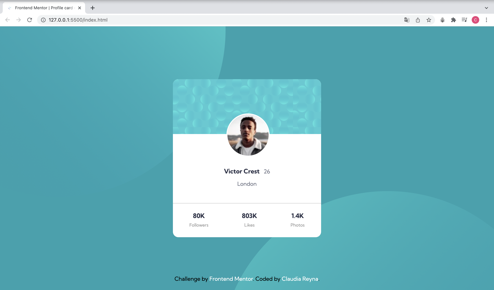

# Frontend Mentor - Profile card component

This is a solution to the [Profile card component](https://www.frontendmentor.io/challenges/profile-card-component-cfArpWshJ). Frontend Mentor challenges help you improve your coding skills by building realistic projects. 

## Table of contents

- [Overview](#overview)
  - [The challenge](#the-challenge)
  - [Screenshot](#screenshot)
  - [Links](#links)
- [My process](#my-process)
  - [Built with](#built-with)
  - [What I learned](#what-i-learned)
  - [Continued development](#continued-development)
  - [Useful resources](#useful-resources)
- [Author](#author)
- [Acknowledgments](#acknowledgments)


## Overview

### The challenge

Build out this profile card component and get it looking as close to the design as possible.

You can use any tools you like to help you complete the challenge. So if you've got something you'd like to practice, feel free to give it a go.

### Screenshot




### Links

- [Solution URL](https://github.com/claurey/profile-card-component)
- [Live Site URL](https://claurey.github.io/profile-card-component/)

## My process

### Built with

- Semantic HTML5 markup
- CSS custom properties
- Flexbox


### What I learned

I learned to use calc for center elements:

```css
.information__image img{
    border-radius: 50%;
    border: 3px solid white;
    position: relative;
    width: 120px;
    top:-60px;
    left: calc(50% - 60px);
}
```


### Useful resources

- [CSS background-position Property](https://www.w3schools.com/cssref/pr_background-position.asp) - This is an amazing article which helped me to style background.


## Author

- Website - [https://github.com/claurey](https://github.com/claurey)
- Frontend Mentor - [@claurey](https://www.frontendmentor.io/profile/claurey)
- Twitter - [@claurey591](https://www.twitter.com/claurey591)

